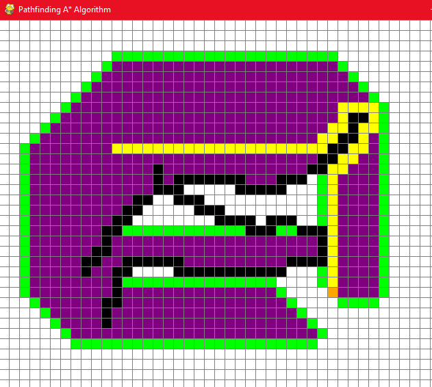
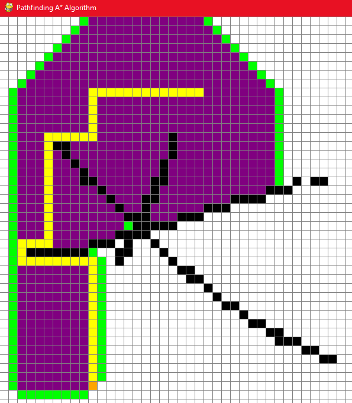
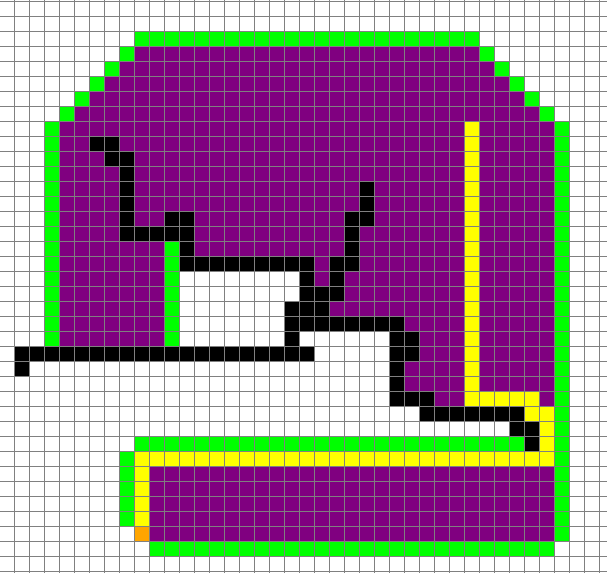

# A* Pathfinding

Utilizing A* Pathfinding and Manhattan distance calculation, this program allows a user to pick a starting and ending point, and then they can draw obstacles in between. From here, the application will find the shortest path from the starting point to the ending point, while avoiding any obstacles set. This program was created with Python using the pygame library and data structures, primarily the Priority Queue. Example outcomes are shown below, where the yellow boxes indicate the shortest path from point A to point B.

# References
Tech With Tim (https://www.youtube.com/c/TechWithTim)
